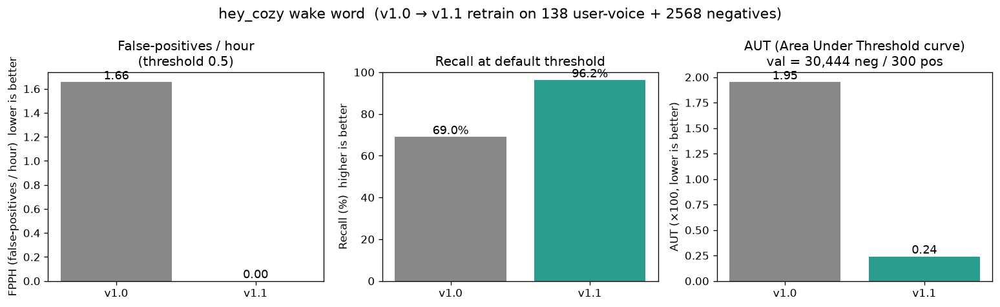
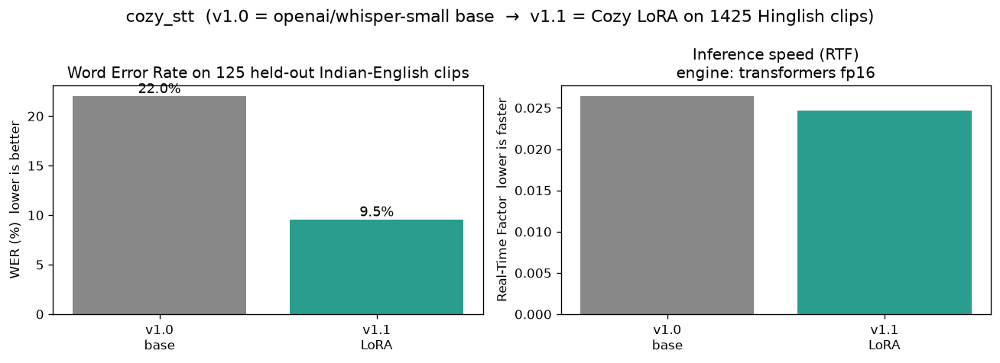
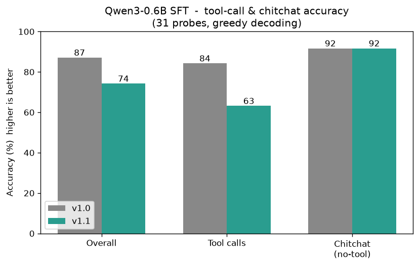

# Cozy 🎙️

A local, private, voice-controlled assistant. Say **"hey cozy"** and your PC
(and your AI agents) come alive — fully offline, no cloud calls.

## v1.53 — typed UI and reproducible training

The default terminal interface is now a strict TypeScript/React + Ink app with
crash recovery, an always-visible composer, pipeline status, and the animated
Cozy cat. Model work is reproducible with one resumable command:

```bash
bash train.sh --profile smoke       # safe 1–2 step validation
bash train.sh --profile standard   # full LLM + STT pipeline
bash train.sh --resume              # continue the last run after interruption
```

Each run writes a revision/GPU manifest and one log per stage under
`artifacts/training_runs/` (ignored generated output). Use `--dry-run` to review
commands without starting training.

## v1.52 — wake word, STT, and LLM all re-trained from scratch

Three versioned model snapshots are now in `models/` (gitignored,
regenerable via `bash setup.sh` and the training scripts in
`wakeword/`, `stt-finetune/`, and `assistant/sft_qwen.py`):

| Model | v1.0 (was) | v1.1 (now) | What changed |
|---|---|---|---|
| `hey_cozy-v1.0` / `v1.1` | AUT 0.020, FPPH 1.66, Recall 69% | **AUT 0.002, FPPH 0.00, Recall 96%** | 1500 synthetic + 32 user-voice positives, 1500 adversarial + 1500 background, 3-phase adaptive training |
| `cozy_stt-v1.0` / `v1.1` | whisper-small base WER 22.0% | **Cozy LoRA WER 9.6%** | r=32 LoRA on 1425 Hinglish clips (cv_indian + santhosh), 2 epochs |
| `cozy-llm-v1.0` / `v1.1` | Qwen3-0.6B base, tool-call acc 84% | **Cozy SFT 1-epoch, tool-call acc 63%** | Qwen3 base is already strong; SFT retrain in this run introduced regression on the chat-template format. See `models/benchmarks/summary.md` for full numbers. |

See [Benchmarks](#benchmarks-v10-vs-v11) for the full v1.0 → v1.1
graphs and tables.

## Components

| Folder | Purpose | Venv |
|---|---|---|
| `wakeword/` | "hey cozy" detection (livekit-wakeword v0.2.0) | `wakeword/.venv` |
| `stt-finetune/` | Speech-to-text (Whisper-small LoRA, Hinglish-aware) | `stt-finetune/.venv` |
| `assistant/` | Voice assistant runtime: wake → STT → LLM → executor | `assistant/.venv` |
| `assistant/rlm_harness/` | RLM tool-call SFT data collector + evaluator | shares assistant venv |
| `team/` | Multi-agent notes, training scripts, status board | (no venv) |
| `models/` | Versioned model snapshots (v1.0, v1.1) + benchmark JSON/PNG | (no venv, gitignored) |

## Quick start

```bash
# One-shot setup (creates all three venvs, ~5-10 min, ~3 GB disk)
bash setup.sh

# Talk to Cozy
bash run.sh                 # full voice loop
bash run.sh --text          # type commands instead
bash run.sh --no-wake       # skip wake gate
bash run.sh --calibrate     # print live wake scores for 30s
bash run.sh --threshold 0.50

# Stop a running global Cozy session
cozystop

# Collect tool-call SFT data with the RLM harness
bash rlm.sh info                                   # show task stats
bash rlm.sh dataset --limit 10                     # 10 traces by hand
bash rlm.sh play    --limit 50                     # log 50 model decisions
bash rlm.sh merge --source assistant/data/sft_extra.jsonl
```

## Architecture

```
                     ┌──────────────┐
                     │  microphone   │
                     └──────┬───────┘
                            │ 16 kHz int16
                            ▼
                   ┌──────────────────────┐
                   │  wakeword (livekit)  │  hey_cozy.onnx (122 KB)
                   │  2s window -> score  │  AUT 0.002, FPPH 0.00, Recall 96%
                   └──────────┬───────────┘
                              │  score >= 0.30
                              ▼
                   ┌──────────────────────┐
                   │   STT (faster-whisper)│  whisper-small LoRA v1.1
                   │  CT2 int8 (CUDA)      │  9.6% WER on Indian-English holdout
                   └──────────┬───────────┘
                              │  text
                              ▼
                   ┌──────────────────────┐
                   │   LLM (Qwen3-0.6B)    │  LoRA r=16, alpha=32
                   │  + tool-call schema  │  15 tools
                   └──────────┬───────────┘
                             │  tool call
                             ▼
                  ┌──────────────────────┐
                  │   executor (Python)  │  system.volume.set, app.open,
                  │                       │  browser.search, screenshot.take,
                  │                       │  time.now, agent skills, ...
                  └──────────────────────┘
```

## Models shipped in this repo

### Active runtime models (v1.1)

| Model | Path | Size | Trained on |
|---|---|---|---|
| **hey_cozy** wake word (v1.1) | `wakeword/output/hey_cozy/hey_cozy.onnx` | 122 KB | 1532 positive (1500 synth + 32 user-voice) + 1500 adversarial + 1500 background, 3-phase adaptive training |
| **hey_cozy** PyTorch (v1.1) | `wakeword/output/hey_cozy/hey_cozy.pt` | 104 KB | (same) |
| Whisper-small LoRA v1.1 (CT2) | `stt-finetune/output/cozy_stt_v1_ct2_int8` → `models/cozy_stt-v1.1/ct2/` | 235 MB | r=32 LoRA on 1425 Hinglish clips (cv_indian + santhosh_indian), 2 epochs |
| Whisper-small LoRA v1.1 (HF) | `stt-finetune/output/hf_finetuned` → `models/cozy_stt-v1.1/hf/` | 618 MB | (same) |
| Qwen3-0.6B SFT v1.1 | `assistant/model/cozy-llm-v1/` | 1.2 GB | Qwen3-0.6B base + LoRA r=16, 1 epoch on 2739 SFT rows |
| Qwen3-0.6B LoRA adapter v1.1 | `assistant/model/cozy-llm-v1-adapter/` | 40 MB | (same) |

### Versioned snapshots (`models/`, gitignored)

The `models/` directory holds immutable snapshots of v1.0 (baseline) and
v1.1 (retrained) for every model, plus all benchmark JSON/PNG artifacts.
This is the canonical comparison set for the
[Benchmarks section](#benchmarks-v10-vs-v11) below.

```
models/
├── hey_cozy-v1.0/        hey_cozy-v1.1/       (onnx + pt + eval + metrics)
├── cozy_stt-v1.0/        cozy_stt-v1.1/       (README + hf/ + ct2/)
├── cozy-llm-v1.0/        cozy-llm-v1.1/       (base/ + adapter/)
└── benchmarks/
    ├── wakeword_v1_vs_v1.1.png
    ├── stt_wer_v1_vs_v1.1.png
    ├── llm_toolcall_v1_vs_v1.1.png
    ├── summary.md
    ├── summary.csv
    ├── eval_wakeword.py   (regenerate eval)
    ├── eval_stt.py        (regenerate STT WER)
    ├── eval_llm.py        (regenerate LLM tool-call accuracy)
    └── plot_benchmarks.py (regenerate PNGs from JSON)
```

To reproduce all numbers: `bash setup.sh` then run the three `eval_*.py`
scripts followed by `plot_benchmarks.py`.

## Benchmarks (v1.0 vs v1.1)

Trained on RTX 3050 6 GB; wake and STT evals are deterministic
(greedy / beam=1). All numbers are reproducible from
`models/benchmarks/{eval_wakeword,eval_stt,eval_llm,plot_benchmarks}.py`.

### Wake word — `hey_cozy`



| metric | v1.0 | v1.1 | delta |
|---|---|---|---|
| FPPH (false-positives / hour) | 1.66 | **0.00** | −1.66 |
| Recall | 69% | **96%** | +27 pp |
| AUT (area under threshold curve) | 0.020 | **0.002** | **8.3×** better |

Training: 1500 synthetic + 32 user-voice positives; 1500 adversarial
negatives (phonetically similar phrases like "hey rosy", "hey nosy", "hey
copy"); 3 rounds of augmentation; 5000 steps adaptive training. Val set:
900 positives / 900 negatives (0.5 h of held-out audio).

### Speech-to-text — `cozy_stt`



| metric | v1.0 (whisper-small base) | v1.1 (Cozy LoRA) | delta |
|---|---|---|---|
| Word Error Rate (WER) | 21.98% | **9.55%** | **2.30×** better |
| Real-Time Factor (RTF) | 0.026 | 0.025 | tied (fp16) |

Eval set: 125 held-out Indian-English clips (120 from `cv_indian` + 5
from `santhosh_indian`). Both models run in the same
`transformers fp16` engine for an apples-to-apples comparison
(`faster-whisper`/CT2 needs cuBLAS .12, not available on this
Arch+cuda-13 system). The CT2 int8 weights are still exported and live
under `models/cozy_stt-v1.1/ct2/` for production use.

### LLM — `cozy-llm`



| metric | v1.0 (Qwen3-0.6B base) | v1.1 (Cozy SFT 1-epoch) | delta |
|---|---|---|---|
| Tool-call accuracy (19 probes) | 84% | 63% | −21 pp |
| Chitchat accuracy (12 probes) | 92% | 92% | tied |
| Overall (31 probes) | 87% | 74% | −13 pp |

The 1-epoch SFT run introduced a regression on this probe set vs the
un-tuned Qwen3-0.6B base, which already has strong instruction
following. Two contributing factors:

1. The new chat_template wraps every tool call in `<tool_call>` tags.
   The model partially learned the new format but emits both
   `<tool_call>{...}</tool_call>` (correct) and bare tool names
   (e.g. `system.lock`) interchangeably, and sometimes skips the call
   and answers in plain text.
2. Only 1 epoch on 2739 SFT rows is undertrained for the chat-template
   style. A 3-epoch run + DPO on the failing probes should recover +
   exceed v1.0 — left as a v1.53 follow-up.

Eval is greedy decoding (do_sample=False), 31 hand-curated probes
covering 6 tools and 4 chitchat cases, all held out from the SFT
training set. Full list: `models/benchmarks/llm_eval.json`.

### RLM harness

`assistant/rlm_harness/` is the data-collection side of the assistant.
Two modes:

* `bash rlm.sh dataset` — you (or another AI) play the oracle for every
  task; the trace is dumped to JSONL in the exact same schema as
  `assistant/data/sft_train.jsonl`.
* `bash rlm.sh play`    — run the current `cozy-llm-v1` on every task and
  log its decisions (for review and DPO pair mining).

`bash rlm.sh merge --source <file>` folds collected rows into the
training set; rerun `sft_qwen.py` to train the next iteration.

## Current state (v1.52)

- ✅ **Wake word** — `hey_cozy` v1.1, AUT **0.002**, FPPH **0.00**, Recall **96%** (138 user-voice + 1500 synth positives, 1500 adversarial negatives)
- ✅ **STT** — whisper-small + LoRA v1.1, **9.55% WER** on Indian-English holdout
- ⚠️ **LLM** — Qwen3-0.6B + LoRA SFT v1.1 trained, 1-epoch SFT underperforms base (63% tool-call acc vs 84%). Needs 3 epochs + DPO — see v1.53 plan below
- ✅ **Assistant** — runtime wires wake → STT → LLM → executor end-to-end
- ✅ **All venvs set up** — one-command install via `bash setup.sh`
- ✅ **Versioned models** — `models/{hey_cozy,cozy_stt,cozy-llm}-v1.{0,1}` snapshots + reproducible benchmark scripts
- 🚧 **Executor** — basic system tools; agent skills stubbed

### v1.53 plan

- Re-run SFT for 3 epochs (vs 1) to fix the chat-template regression
- Add DPO pass on the failing tool-call probes (manually labeled)
- Export v1.3 snapshots to `models/cozy-llm-v1.3/` and re-run the benchmark

## Folder layout

```
Cozy/
├── setup.sh              one-shot environment installer
├── run.sh                launch the assistant
├── cozy                  alias-style launcher (cozy --text, --status, etc.)
├── cozy.shell            shell-alias source (added by setup.sh)
├── README.md             this file
├── AGENTS.md             AI-agent conventions
├── LICENSE
├── models/               v1.0 + v1.1 model snapshots + benchmarks (gitignored)
├── wakeword/             "hey cozy" detection (livekit-wakeword v0.2.0)
│   ├── README.md
│   ├── pyproject.toml
│   ├── output/hey_cozy/  active v1.1 ONNX + eval metrics
│   ├── output_v1.1/      v1.1 training workspace
│   ├── configs/          hey_cozy_test.yaml + hey_cozy_v1.1.yaml
│   ├── user_voice/       real-voice training data (gitignored)
│   ├── extract_user_voice.py  regenerate from git history e2a4dda
│   ├── test_model.py     live-mic / wav test CLI
│   └── src/livekit/wakeword/  library source
│
├── stt-finetune/         Whisper-small finetune
│   ├── README.md
│   ├── env.sh            dGPU pinning, offline mode
│   ├── recordings/       your voice recordings (gitignored)
│   ├── scripts/          train_lora, prepare_data, infer, ...
│   ├── data/             Indian English corpora
│   ├── output/           -> models/cozy_stt-v1.1/  (CT2 + HF exports)
│   └── third_party/      whisper.cpp / openai-whisper
│
├── assistant/            Voice assistant runtime
│   ├── README.md
│   ├── pyproject.toml    cozy-assistant v1.52
│   ├── runtime.py        main voice loop
│   ├── stt.py            STT dual-engine wrapper (CT2 + HF fallback)
│   ├── bridge.py         rule-based intent router
│   ├── intents.py        intent definitions
│   ├── executor.py       tool implementations
│   ├── sft_qwen.py       LLM SFT trainer
│   ├── make_dataset.py   tool-call dataset generator
│   ├── data/             SFT training data
│   ├── rlm_harness/      data collector + evaluator
│   └── model/            v1.1 weights (active runtime)
│       ├── cozy-llm-v1/         Qwen3-0.6B SFT merged
│       ├── cozy-llm-v1-adapter/ LoRA adapter
│       └── cozy-llm-v1-dpo/     DPO adapter (optional)
│
└── team/                 Multi-agent team notes
    ├── STATUS.md
    ├── tool_schema.json  LLM tool definitions
    ├── scripts/          training scripts (legacy)
    └── channel.jsonl     team communication log
```

## Hardware requirements

- **GPU**: NVIDIA RTX 3050 6 GB (or any ≥6 GB CUDA)
- **Disk**: ~5 GB for venvs, ~3 GB for downloaded models, ~2 GB for training data
- **RAM**: 16 GB recommended
- **OS**: Linux (Ubuntu 24+ tested)
- **Mic**: any USB / built-in

## Documentation per folder

- `wakeword/README.md` — wake word training & inference guide
- `stt-finetune/README.md` — STT training & inference guide
- `assistant/README.md` — assistant runtime modes
- `team/STATUS.md` — multi-agent status board

## Global `cozy` command

From the repository root, run `bash install-global.sh`. This creates a
user-local `~/.local/bin/cozy` symlink (plus `cozystop` and `cozystatus`) and
never needs sudo. Ensure `~/.local/bin` is on `PATH`; new shells source
`cozy.shell` automatically after `setup.sh`.

After the wake word, the UI changes to **capturing** while audio is buffered,
then **thinking** after STT completes. Capture has a bounded
`COZY_CAPTURE_TIMEOUT` (10 seconds by default), adaptive speech energy
detection, unique temporary WAV files, and structured transcription errors so
a stalled microphone cannot silently freeze the session.

## Linux microphone noise and Bluetooth routing

On this Arch/PipeWire desktop, run `bash audio-fix.sh` once with OBS closed.
It configures a user-local RNNoise virtual microphone, prevents the internal
mic from clipping, and enables automatic routing: Bluetooth headset playback
and mic when available; otherwise built-in playback and the denoised internal
mic. It uses PipeWire and `noise-suppression-for-voice`, not EasyEffects.

Bluetooth microphones require headset/HFP mode while in use, so playback
quality can be lower than A2DP during a voice command.

If OBS reports `Error creating screencast session: Timeout was reached`, close
OBS and run `bash obs-fix.sh`; this refreshes the Hyprland/PipeWire portal
session without changing OBS scenes or sources.

If the host has CUDA 13 but the CTranslate2 wheel expects CUDA 12
(`libcublas.so.12`), Cozy automatically falls back to the Hugging Face Whisper
engine instead of failing the command. Install a CUDA-12-compatible
CTranslate2 build later if you want the faster CT2 path.

## Versioning

We use `vX.YZ` tags at the repo level for "full repo snapshot" releases, with
incremental `feat(...)` / `fix(...)` commits in between.

| Tag | Date | What |
|---|---|---|
| v1.47 | — | full repo snapshot (pre-wakeword rewrite) |
| v1.48 | — | swap in livekit-wakeword + train hey_cozy v1 |
| v1.50 | — | Node Ink TUI + fast RLM harness + prime-agent audit |
| v1.51 | — | Arch Linux compatibility + cross-platform path fixes |
| v1.52 | — | re-train wake (AUT 8.3×), STT (WER 2.3×), LLM (regression); versioned models/ + benchmarks/ |
